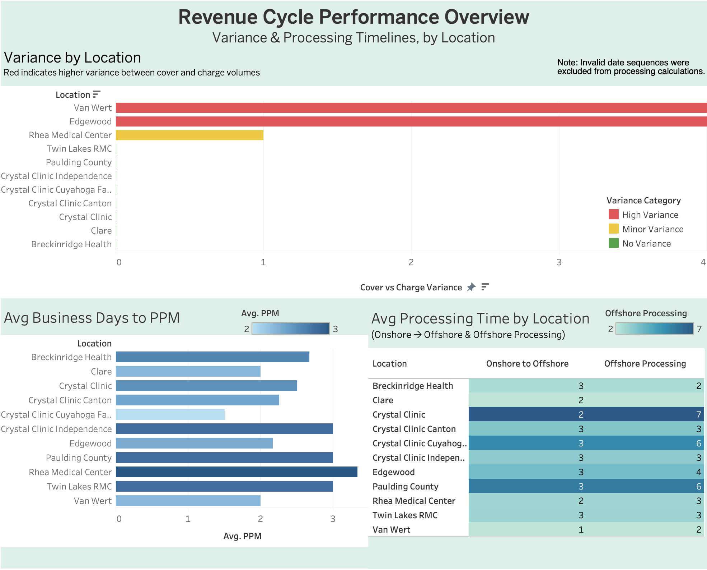

# Revenue Cycle Analyst Competency Exercise

## Overview

This project analyzes charge batch data to identify volume discrepancies and evaluate processing turnaround across a healthcare revenue cycle workflow.

The analysis was designed as a management reporting exercise, combining Excel-based data reconciliation with Tableau visualizations to highlight exceptions, monitor workflow timelines, and support operational decision-making.

## Business Objective

The objective was to create management reporting that provides visibility into two key areas:

* **Data accuracy:** Identify locations with variances between the coversheet, charge sheet, and iStats volume data.
* **Operational efficiency:** Measure business-day turnaround at different stages of the charge-processing workflow.

## Analysis & Reporting

### Charge Volume Variance Analysis

I reconciled charge volume information across the coversheet, charge sheet, and iStats data.

The analysis identifies locations where reported volumes do not align across the three sources, allowing management to quickly identify exceptions that require further investigation.

This approach supports data accuracy by focusing attention on locations with discrepancies rather than requiring manual review of every record.

### Processing Timeline Analysis

I calculated business-day turnaround across multiple stages of the workflow:

**Location → PPM**

Measured how many business days each location took to provide the required data to PPM.

**Onshore → Offshore**

Measured the business-day turnaround between Onshore sending the data to Offshore.

**Offshore Processing**

Measured how many business days Offshore took to process the data after receiving it from Onshore.

Together, these metrics provide visibility into where time is being spent throughout the workflow and help identify potential processing bottlenecks.

## Management Report

The final Tableau report combines the variance analysis and processing-time metrics into a management-focused visual report.

The report allows stakeholders to review data discrepancies and workflow turnaround by location in a consolidated view.

## Tools & Skills

**Excel**

* Data reconciliation
* Formula-based analysis
* Business-day calculations
* Data validation
* Operational reporting

**Tableau**

* Data visualization
* Management dashboards
* Exception reporting
* Operational performance visualization

**Revenue Cycle Analytics**

* Charge reconciliation
* Variance analysis
* Turnaround-time analysis
* Workflow analysis
* Management reporting
* Operational problem identification

## Deliverables

| Deliverable                      | Purpose                                                             |
| -------------------------------- | ------------------------------------------------------------------- |
| Charge Batch Analysis            | Reconcile operational volume data                                   |
| Variance Analysis                | Identify discrepancies between coversheet, charge sheet, and iStats |
| Location-to-PPM Analysis         | Measure business-day submission turnaround                          |
| Onshore-to-Offshore Analysis     | Measure operational handoff turnaround                              |
| Offshore Processing Analysis     | Measure downstream processing time                                  |
| Tableau Management Report        | Visualize variances and processing timelines                        |
| Variance Follow-Up Communication | Communicate discrepancies requiring clinic review                   |

## Business Value

The analysis converts operational charge data into management-ready information that can be used to identify exceptions and monitor workflow performance.

By combining reconciliation with turnaround-time analysis, the report provides visibility into both **data quality** and **process efficiency** across the revenue cycle workflow.

## Key Takeaways

This project demonstrates my ability to:

* Reconcile data across multiple operational sources
* Identify and investigate data variances
* Calculate business-day turnaround metrics
* Analyze workflow performance
* Build management-focused visualizations in Tableau
* Translate operational data into actionable reporting
* Communicate data discrepancies to business stakeholders
